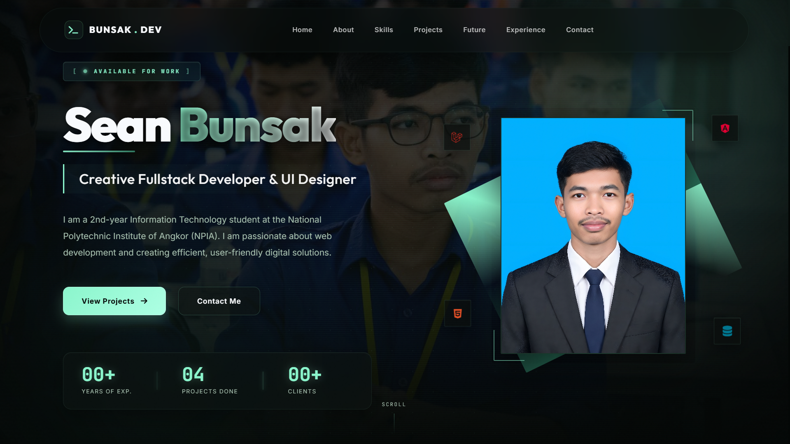

# Sean Bunsak — Web Developer Portfolio



A premium, cinematic personal portfolio showcasing my expertise in Fullstack Development, UI/UX Design, and Management Systems. Built with a focus on modern aesthetics, responsiveness, and performance.

## 🚀 Live Demo
Visit the live site: [bunsak.dev](https://bunsak.dev/)

## ✨ Key Features
- **Cinematic V6 Design**: High-end UI with glassmorphism, glowing accents, and smooth transitions.
- **Responsive Layout**: Optimized for all devices from mobile to large desktop screens.
- **Dynamic Projects Showcase**: Detailed views of recent work including NPIA Drink, POS Management, and School MS.
- **Interactive Tech Stack**: Modular representation of technical skills with animated progress indicators.
- **Future Lab**: A roadmap of upcoming projects and innovations.
- **Direct Contact**: Integrated social links and contact points for professional inquiries.

## 🛠️ Tech Stack
- **Frontend**: HTML5, CSS3 (Vanilla), JavaScript (ES6+), Font Awesome
- **Backend (Projects)**: Laravel, PHP, MySQL
- **Design Tools**: Figma, Photoshop
- **Environment**: Laragon, Git/GitHub

## 📂 Project Structure
```text
├── img/                # Visual assets and project screenshots
├── index.html          # Main application structure
├── style.css           # Cinematic V6 design system and layouts
├── script.js           # Interactive elements and animations
└── README.md           # Project documentation
```

## 📈 Recent Updates
- **v6.0.0**: Redesigned Technical Skills section with cinematic V6 aesthetic and new background.
- **v5.8.0**: Updated social sharing meta tags and localized profile descriptions.
- **v5.5.0**: Refined Future Lab layout with hover-triggered project descriptions.

## 🤝 Contact
- **Telegram**: [@seanbunsak](https://t.me/Seanbunsak)
- **Facebook**: [Sean Bunsak](https://www.facebook.com/share/1Hr6xiG7v3/?mibextid=wwXIfr)
- **Email**: skh871081@gmail.com
- **Location**: Siem Reap, Cambodia 🇰🇭

---
*Created with passion by [Sean Bunsak](https://github.com/Mrsakk)*
